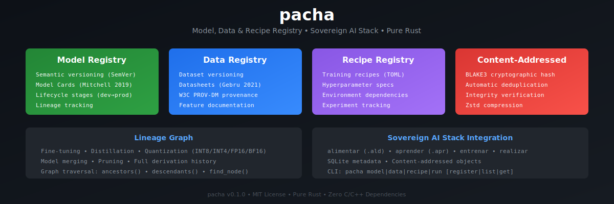

<p align="center">
  
</p>

<h1 align="center">pacha</h1>

<p align="center">
  <b>Model, Data and Recipe Registry with full lineage tracking.</b>
</p>

<p align="center">
  <a href="https://crates.io/crates/pacha"></a>
  <a href="https://docs.rs/pacha"></a>
  <a href="https://opensource.org/licenses/MIT"></a>
</p>

---

## Installation

```toml
[dependencies]
pacha = "0.1"
```

## Usage

```rust
use pacha::prelude::*;

fn main() -> Result<()> {
    let registry = Registry::open(RegistryConfig::default())?;

    // Register a model with documentation
    let card = ModelCard::builder()
        .description("Fraud detection model")
        .metrics([("auc", 0.95), ("f1", 0.88)])
        .build();

    registry.register_model(
        "fraud-detector",
        &ModelVersion::new(1, 0, 0),
        &model_bytes,
        card,
    )?;

    Ok(())
}
```

## Examples

```bash
cargo run --example quick_start
cargo run --example model_versioning
cargo run --example experiment_tracking
cargo run --example lineage_tracking
cargo run --example content_addressing
```

## CLI

```bash
pacha init
pacha model register fraud-detector model.apr -v 1.0.0
pacha model list
pacha model stage fraud-detector -v 1.0.0 -t production
pacha stats
```

## Features

| Feature | Description |
|---------|-------------|
| `compression` | Zstd compression (default) |
| `cli` | Command-line interface (default) |
| `encryption` | AES-256-GCM encryption |

## Contributing

Contributions welcome! Please follow the PAIML quality standards:

1. Fork the repository
2. Create a feature branch
3. Ensure all tests pass: `cargo test`
4. Run quality checks: `cargo clippy -- -D warnings && cargo fmt --check`
5. Submit a pull request

## License

MIT
