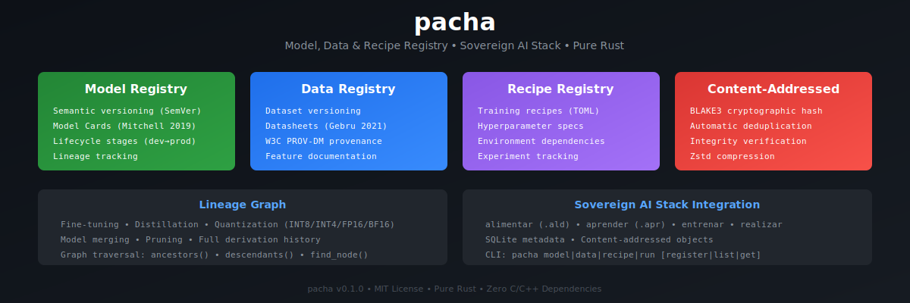

<p align="center">
  
</p>

<h1 align="center">pacha</h1>

<p align="center">
  <b>Model, Data and Recipe Registry with full lineage tracking.</b>
</p>

<p align="center">
  <a href="https://crates.io/crates/pacha"></a>
  <a href="https://docs.rs/pacha"></a>
  <a href="https://github.com/paiml/pacha/actions/workflows/ci.yml"></a>
  <a href="https://opensource.org/licenses/MIT"></a>
  <a href="https://github.com/paiml/pacha"></a>
</p>

---

## Table of Contents

- [Overview](#overview)
- [Architecture](#architecture)
- [Installation](#installation)
- [Usage](#usage)
- [CLI](#cli)
- [Features](#features)
- [Benchmarks](#benchmarks)
- [Testing](#testing)
- [Security](#security)
- [Contributing](#contributing)
- [License](#license)

## Overview

Pacha is a unified registry for machine learning artifacts -- models, datasets, and training
recipes -- with full lineage tracking, semantic versioning, and cryptographic integrity
verification. It provides content-addressed storage with BLAKE3 hashing for deduplication,
tamper detection, and efficient delta storage.

### Key Capabilities

- **Model Registry** - Register, version, and stage ML models with metadata and metrics
- **Data Registry** - Track datasets with schema validation and provenance
- **Recipe Registry** - Store training configurations with hyperparameters and environment specs
- **Lineage Tracking** - Full dependency graph from data to deployed model
- **Content-Addressed Storage** - BLAKE3-based deduplication and integrity verification
- **Cryptographic Signing** - Ed25519 signatures for artifact authenticity
- **Experiment Tracking** - Record training runs with metrics, parameters, and artifacts

## Architecture

```
+------------------+     +------------------+     +------------------+
|  Model Registry  |     |  Data Registry   |     | Recipe Registry  |
|  (.apr files)    |     |  (.ald files)    |     | (TOML configs)   |
+--------+---------+     +--------+---------+     +--------+---------+
         |                        |                        |
         +------------------------+------------------------+
                                  |
                      +-----------+-----------+
                      |   Content-Addressed   |
                      |   Storage (BLAKE3)    |
                      +-----------+-----------+
                                  |
                      +-----------+-----------+
                      |  SQLite Metadata DB   |
                      |  (~/.pacha/registry)  |
                      +-----------------------+
```

## Installation

Add to your `Cargo.toml`:

```toml
[dependencies]
pacha = "0.2"
```

Or install the CLI:

```bash
cargo install pacha
```

## Usage

```rust
use pacha::prelude::*;

fn main() -> Result<()> {
    let registry = Registry::open(RegistryConfig::default())?;

    // Register a model with documentation
    let card = ModelCard::builder()
        .description("Fraud detection model")
        .metrics([("auc", 0.95), ("f1", 0.88)])
        .build();

    registry.register_model(
        "fraud-detector",
        &ModelVersion::new(1, 0, 0),
        &model_bytes,
        card,
    )?;

    // Retrieve and inspect
    let model = registry.get_model(
        "fraud-detector",
        &ModelVersion::new(1, 0, 0),
    )?;
    println!("Stage: {}", model.stage);

    Ok(())
}
```

### Data Registry

```rust
use pacha::data::*;

// Register a dataset with schema
let schema = DataSchema::new(vec![
    Column::new("feature_1", DataType::Float64),
    Column::new("label", DataType::Int32),
]);

registry.register_data(
    "training-set-v2",
    &DataVersion::new(2, 0, 0),
    &data_bytes,
    schema,
)?;
```

### Experiment Tracking

```rust
use pacha::experiment::*;

let experiment = Experiment::builder()
    .name("fraud-detection-v3")
    .model("fraud-detector", &ModelVersion::new(1, 0, 0))
    .dataset("training-set-v2")
    .hyperparams([("lr", "0.001"), ("epochs", "50")])
    .build();

registry.log_experiment(experiment)?;
```

## CLI

```bash
# Initialize a registry
pacha init

# Model operations
pacha model register fraud-detector model.apr -v 1.0.0
pacha model list
pacha model stage fraud-detector -v 1.0.0 -t production
pacha model inspect fraud-detector -v 1.0.0

# Data operations
pacha data register training-set data.ald -v 1.0.0
pacha data list

# Registry statistics
pacha stats
```

## Features

| Feature | Description | Default |
|---------|-------------|---------|
| `compression` | Zstd compression for stored artifacts | Yes |
| `cli` | Command-line interface | Yes |
| `signing` | Ed25519 cryptographic signing | Yes |
| `encryption` | ChaCha20-Poly1305 encryption at rest | No |
| `remote` | HTTP remote registry support | No |
| `lineage-graph` | Graph-based lineage visualization | No |
| `aprender-integration` | Integration with aprender ML library | No |
| `alimentar-integration` | Integration with alimentar data library | No |

Enable all features:

```toml
[dependencies]
pacha = { version = "0.2", features = ["full"] }
```

## Benchmarks

Run benchmarks with:

```bash
cargo bench
```

Content-addressing operations (BLAKE3 hashing, storage, retrieval) are benchmarked
using Criterion. See `benches/content_address.rs` for benchmark definitions.

## Testing

```bash
# Unit tests
cargo test --lib

# All tests (unit + integration)
cargo test

# All features
cargo test --all-features

# With nextest (faster)
cargo nextest run

# Quality gates
make tier1   # Fast feedback: fmt, clippy, check
make tier2   # Pre-commit: tests + clippy
make tier3   # Pre-push: full validation

# Coverage
make coverage

# Mutation testing
cargo mutants --no-times --timeout 300
```

## Security

- **Cryptographic Integrity**: All artifacts are content-addressed with BLAKE3
- **Ed25519 Signing**: Optional artifact signing for authenticity verification
- **Encryption at Rest**: Optional ChaCha20-Poly1305 encryption
- **Dependency Auditing**: `cargo-deny` and `cargo-audit` in CI pipeline
- **No Unsafe Code**: `#![deny(unsafe_code)]` enforced project-wide

To report a security vulnerability, please email security@paiml.com.

## Contributing

Contributions welcome! Please follow the PAIML quality standards:

1. Fork the repository
2. Ensure all tests pass: `cargo test`
3. Run quality checks: `cargo clippy -- -D warnings && cargo fmt --check`
4. Submit a pull request

## MSRV

Minimum Supported Rust Version: **1.75**

## See Also

- [Cookbook](https://github.com/paiml/sovereign-ai-cookbook)

## License

MIT - see [LICENSE](LICENSE) for details.
